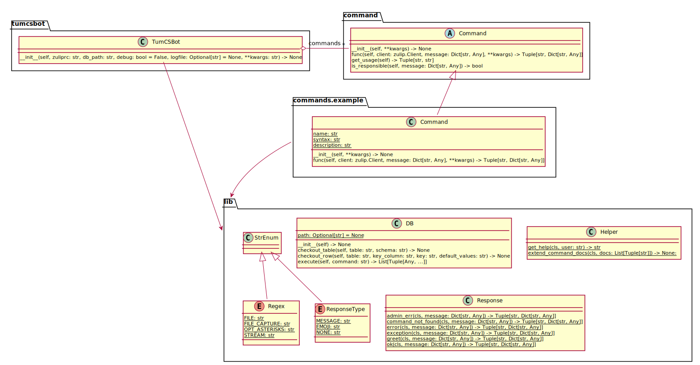

TUM CS Bot
==========

An interactive bot for zulip.in.tum.de, the [Zulip Chat](https://zulipchat.com/)
of the Department of Informatics of the Technichal University of Munich.

**Note: This bot is currently under development and not yet production-ready!**


setup
-----

Currently, no special setup required. The bot only needs its `zuliprc` file
which you receive when adding the bot to your Zulip instance. Currently, the
bot is intended to run as `Generic` bot, owned by an administrator.
- [add a bot](https://zulipchat.com/help/add-a-bot-or-integration)
- [about bots](https://zulipchat.com/help/bots-and-integrations)

Note: If you like the command `subscribe` to work even if the destination stream
does not yet exist (so that the bot needs to create the stream), the bot needs
administrator rights
([documentation](https://github.com/zulip/zulip/blob/master/docs/production/security-model.md)).
In order to grant those rights, run
`manage.py knight --for-real --permission=administer <bot_email>` in the appropriate
directory of your zulip server installation.


usage
-----

- `make install` will install a virtual environment into a folder called `bin`.
  (Do not forget to copy the bot's `zuliprc` file into `bin` after installation).
- `make run` lets you run the bot.
- `make debug` runs the bot with debug logging enabled.
- `make uninstall` uninstalls everything under `bin` (except the `zuliprc`).

You can also run the bot manually:
```
usage: tumcsbot.py [-h] [-d] [-l LOGFILE] ZULIPRC

This bot is currently especially intended for administrative tasks.
It supports several commands which can be written to the bot using
a private message or a message starting with @mentioning the bot.

positional arguments:
  ZULIPRC               zuliprc file containing the bot's configuration

optional arguments:
  -h, --help            show this help message and exit
  -d, --debug           print debug information on the console
  -l LOGFILE, --logfile LOGFILE
                        use LOGFILE for logging output
```


usage in chat
-------------
Write the word `help` to the bot - as private message or using
`@<tumcsbot-name> help`. It will tell you how you can use it. :-)


notes
-----

My work on the possibility of accessing a file that the sender has added to a
message using the "Attach files" function and my questions about this topic on
chat.zulip.org have led to the corresponding issue on github:
https://github.com/zulip/python-zulip-api/issues/628

The bot supports a dynamic plugin infrastructure and also generates the help
message dynamically by using appropriate attributes every plugin has to
provide.

model
-----



